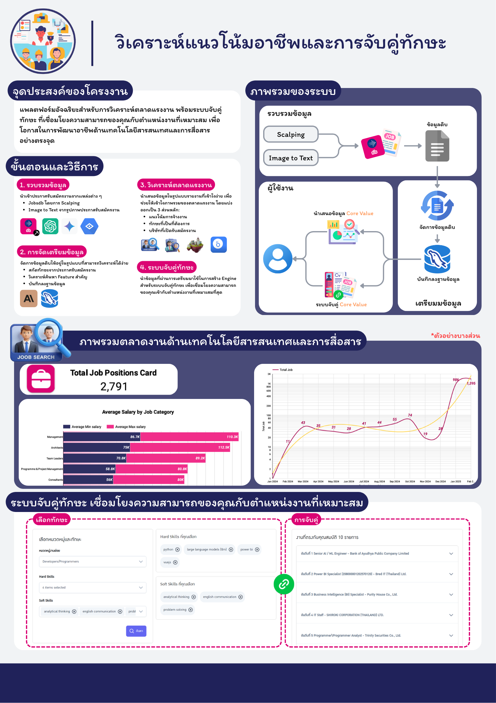

# SkillMap Client: ระบบวิเคราะห์แนวโน้มอาชีพและจับคู่ทักษะ


## เกี่ยวกับโปรเจค

SkillMap Client เป็นส่วน Frontend ของระบบ [SkillMap Server](https://github.com/peerapoljantimee/skillmap-server) ที่พัฒนาขึ้นเพื่อสร้างแพลตฟอร์มอัจฉริยะสำหรับการวิเคราะห์ตลาดแรงงาน พร้อมระบบจับคู่ทักษะที่เชื่อมโยงความสามารถของผู้ใช้กับตำแหน่งงานที่เหมาะสม เพื่อเพิ่มโอกาสในการพัฒนาอาชีพด้านเทคโนโลยีสารสนเทศและการสื่อสารอย่างตรงจุด

## คุณสมบัติหลัก

- แสดงแนวโน้มตลาดงานในปัจจุบัน
- จับคู่ทักษะกับหมวดหมู่และตำแหน่งงานที่เหมาะสม
- รวบรวมข้อมูล
- ดึงข้อมูลตำแหน่งงานจากเว็บไซต์หางานโดยอัตโนมัติ
- วิเคราะห์และสกัดทักษะจากประกาศรับสมัครงานด้วย AI
- แปลงภาพโปสเตอร์ประกาศรับสมัครงานเป็นข้อความเพื่อช่วยในการรวบรวมข้อมูลตำแหน่งงานด้วย AI

## ความต้องการของระบบ

- Node.js 23.4.0 หรือสูงกว่า
- npm หรือ yarn
- เชื่อมต่อกับ [SkillMap Server](https://github.com/peerapoljantimee/skillmap-server) สำหรับ API

## การติดตั้ง

### ขั้นตอนที่ 1: โคลนโปรเจค

```bash
git clone https://github.com/peerapoljantimee/skillmap-client.git
cd skillmap-client
```

### ขั้นตอนที่ 2: ติดตั้ง Dependencies

```bash
npm install
```

## การเริ่มต้นใช้งาน

### เริ่มต้นในโหมด Development

```bash
npm run dev
```

### สร้าง Production Build

```bash
npm run build
```

### รัน Production Preview

```bash
npm run preview
```

## โครงสร้างโปรเจค

โปรเจคนี้ใช้โครงสร้างแบบ Vue.js Component-Based Architecture

```
skillmap-client/
├── index.html               # HTML entry point
├── jsconfig.json            # JavaScript configuration
├── package.json             # Node.js dependencies
├── public/                  # Static assets
│   └── favicon.ico
├── src/
│   ├── App.vue              # Main Vue component
│   ├── assets/              # Images, fonts, and styles
│   ├── components/          # Vue components
│   │   ├── admin/           # Components for admin features
│   │   ├── auth/            # Authentication components
│   │   ├── common/          # Shared/common components
│   │   ├── icons/           # Icon components
│   │   ├── jobMatching/     # Job matching feature components
│   │   └── layout/          # Layout components
│   ├── main.js              # JavaScript entry point
│   └── router/              # Vue Router configuration
│       └── index.js
└── vite.config.js           # Vite configuration
```

## เทคโนโลยีหลัก

- **Vue.js:** JavaScript framework สำหรับสร้าง UI
- **Vue Router:** จัดการการนำทางในแอปพลิเคชัน
- **PrimeVue:** UI Component Library สำหรับ Vue.js
- **Bootstrap:** CSS framework สำหรับ responsive design
- **Axios:** Library สำหรับการทำ HTTP requests
- **Vite:** Build tool ที่รวดเร็วสำหรับ frontend development

## การเชื่อมต่อกับ Backend

SkillMap Client ใช้ Axios เพื่อเชื่อมต่อกับ [SkillMap Server](https://github.com/peerapoljantimee/skillmap-server) API. การกำหนดค่า API base URL


# Infographic Poster

